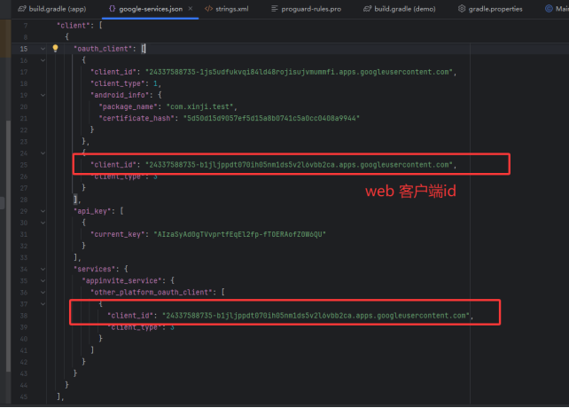
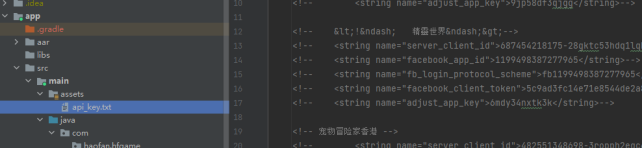
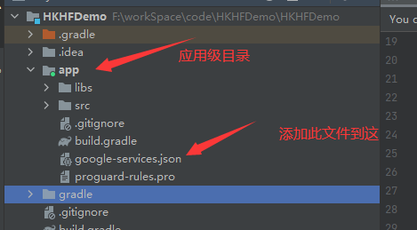

海外 SDK 接入文档

# 1.概述

本文档面向安卓开发者，用于指导开发者快速接入 海外SDK，本 SDK 为本 SDK
用于 Android APP
嵌入用户中心、收费模块、广告弹窗模块，用户中心目前支持使用浩凡账号登录、facebook账号登录、amazon登录、google
账号登录，收费模块支持支付宝、微信、google、paypal、mycard。提供多个接口给集成者调用。

重要提醒：

**所有的 SDK 操作都必须在应用成功授权之后才能继续执行**

**最新更新内容均已（此颜色标注）**

# 2.接入流程

## 2.1 申请应用配置

### 2.1.1查看出包物料

<table>
<colgroup>
<col style="width: 35%" />
<col style="width: 64%" />
</colgroup>
<tbody>
<tr>
<td style="text-align: left;"><strong>名称</strong></td>
<td style="text-align: left;"><strong>值</strong></td>
</tr>
<tr>
<td style="text-align: left;"><strong>包名</strong></td>
<td style="text-align: left;">com.xx.xx</td>
</tr>
<tr>
<td style="text-align: left;"><strong>游戏名称</strong></td>
<td style="text-align: left;">安卓测试</td>
</tr>
<tr>
<td style="text-align: left;"><strong>游戏PID</strong></td>
<td style="text-align: left;">310000</td>
</tr>
<tr>
<td style="text-align: left;"><strong>内购ID</strong></td>
<td style="text-align: left;">hfceshi1</td>
</tr>
<tr>
<td style="text-align: left;"><strong>Facebook授权Key</strong></td>
<td style="text-align: left;">facebook登录需要配置的参数（不用facebook可不提供）</td>
</tr>
<tr>
<td style="text-align: left;"><strong>Adjust授权key</strong></td>
<td style="text-align: left;">Adjust追踪配置的参数</td>
</tr>
<tr>
<td style="text-align: left;"><strong>Tiktok自归因参数</strong></td>
<td style="text-align: left;">xxxxxxx(不用tiktok 可不提供)</td>
</tr>
<tr>
<td style="text-align: left;"><strong>Google-services.json</strong></td>
<td style="text-align: left;">FirebaseAndroid配置文件</td>
</tr>
<tr>
<td style="text-align: left;"><strong>api_key.txt</strong></td>
<td style="text-align: left;">Amazon授权key（无amazon登录可不提供）</td>
</tr>
</tbody>
</table>

## 2.1.2 环境要求

注：最低版本不能低于35，google要求。

compileSdkVersion 35

buildToolsVersion "35.0.0"

minSdkVersion 大于等于23

Gradle版本大于8.0

## 2.2 根据包名创建项目

生成debug的sha1和release的sha1，提供给我方的运营人员，且提供facebook的测试账号，google的测试账号以及Adjust的测试账号。

## 2.3 导入资源包

### 2.3.1 添加仓库

````
repositories {

  google()
  
  jcenter()
  
  mavenCentral()
  
  maven { url "https://jitpack.io" }

  maven {
  
    url "https://dl-maven-android.mintegral.com/repository/se\_sdk\_for\_android/"
  
  }
  
  //topon 广告仓库（不接广告不用引用）

  flatDir {
  
    dirs 'libs'
  
  }

  maven {
  
    url "https://jfrog.anythinktech.com/artifactory/overseas\_sdk"
  
  }
  
  //tiktok 仓库
  maven { url 'https://jitpack.io' } // add this line!!
  
  //SDK适配器仓库
  
  maven {
  
    url "https://maven.pkg.github.com/fjlingliu/xinjiAndroidSdk"
    
    credentials {
    //todo  根据文档去替换
      username = "xxxx"
      
      password = "xxxxxxxxx"
  
  }

}

}
````

###  

###  

### 2.3.2 配置build.gradle文件

**添加引用**

````

//核心库

//todo 核心库- 根据文档下载版本去替换
implementation 'com.xxx.xxx:core:xxxx'
//todo 支付库- 根据文档下载版本去替换
implementation 'com.xxx.xxxx:pay-google:xxxx'

//基础库

implementation 'androidx.appcompat:appcompat:1.4.1'

implementation 'com.google.android.material:material:1.12.0'//版本升级

implementation(platform("com.google.firebase:firebase-bom:33.15.0"))

implementation 'com.google.firebase:firebase-analytics'

implementation 'androidx.constraintlayout:constraintlayout:2.1.4'

implementation 'com.google.code.gson:gson:2.8.9'

````

## 2.4 配置应用的参数配置

### 2.4.1 string.xml中添加如下配置


```
<!--  google参数（必填） -->
<string name="google_web_client_id"></string>

<!--  fb登录参数（无fb登录默认值即可）  -->
<string name="facebook_app_id"></string>
<string name="fb_login_protocol_scheme"></string>
<string name="facebook_client_token"></string>

<!--  adjust 事件（无此功能默认即可） -->
<string name="adjust_app_key"></string>

<!--  应用唯一标志 app id （必填） -->
<string name="application_id"></string>

<!--  tiktok事件自归因  -->
<string name="tt_app_id"></string>

<!--  applovin广告sdk key （无广告忽略此字段）-->
<string name="applovin_sdk_key"></string>
<!--  google广告id （无广告忽略此字段） -->
<string name="gg_admob_app_id"></string>
```
**注意：**
默认配置已配置，实际配置id找运营索要物料

**参数详解：**

1. **‘fb配置’如果没有接入facebook登录可为空**

    1. **参数fb\_login\_protocol\_scheme：此参数为”fb”+facebook\_app\_id**

    2. **参数facebook\_client\_token：对应物料中的“客户端口令”**

2. **application\_id 为应用的唯一标志**

3. **Goolge\_web\_client\_id 可从Google-service.json文件中获取**

   

### 2.4.2 amazon登录授权key（如不接amazon登录可忽略此步骤）

将api\_key.txt文件移入assets文件夹下



### 2.4.3添加google play服务

在项目的顶级build.gradle文件，确保谷歌的Maven仓库包括：

````
buildscript {
  
    repositories {
    
      google()
      
      mavenCentral()
      
      maven { url 'https://maven.google.com' }
    
    }
    
    dependencies {
    
      classpath 'com.android.tools.build:gradle:8.4.0'//注：gradle版本高于8.0
      
      classpath 'com.google.gms:google-services:4.3.15'
      
      // NOTE: Do not place your application dependencies here; they belong
      
      // in the individual module build.gradle files
    
    } 
  
  }
  
  allprojects {
  
    repositories {
    
      google()
      
      mavenCentral()
      
      jcenter()
      
      // maven { url "https://jitpack.io" }
    
    }

}
````

### 2.5 google-services.json文件配置

将配置文件移动到应用的模块（应用级）目录中。



### 2.6应用级build.gradle配置（app/build.gradle） 

``````
apply plugin: 'com.android.application'

// Add the following line:

apply plugin: 'com.google.gms.google-services'  // Google Services
plugin

android {

// ...

}
``````

# 3 接口说明

## 3.0 初始化

**注意：**

必须在Application下的onCreate中初始化

```
public class MyApplication extends Application {
    @Override
    public void onCreate() {
        super.onCreate();
        IGameManage.Builder.build().onAppCreate(this);
    }
}

```

## 3.1 授权接口

此接口必须在APP刚启动时(必须在登录之前)调用，用于给当前APP授权，**授权成功后才可以进行登录和支付**。调用方法如下：

**注意：**

init**接口中传入的Activity不可被销毁，否则会产生Crash**

```
IGameManage.Builder.build().init(Activity activity, AuthorizationRequest request, XJInitCallBack callBack);

```

接口所需参数：

| 参数 | 可否为空 | 描述 |
|------|----------|------|
| **Activity** | 不可以 | 上下文 |
| **InitRequest** | 不可以 | 授权信息 |
| **InitCallBack** | 不可以 | 授权回调对象，用于处理授权结果 |

**InitRequest 实体类**

| 字段 | 可否为空 | 说明 |
|------|----------|------|
| fullScreen | 不可以 | 设置游戏界面是否是全屏 |
| pid | 不可以 | 游戏PID |
| gameName | 不可以 | 游戏名称 |

**InitCallBack 回调说明**

| 方法 | 说明                                                                         |
|------|----------------------------------------------------------------------------|
| `onLogout()` | 退出登录成功，游戏可调用相对应的游戏退出操作，并重新调用登录接口                                           |
| `onBindThirdPart(IXJUserInfo info)` | 以游客登录的情况下，用户绑定三方登录（可无需处理）                                                  |
| `onCancellationAccount()` | 注销账号成功，如果用户未在15天内没有再次登录，那么账号将彻底废弃（对接时可当退出登录处理）                             |
| `onInitResult(int code, String s)` | 授权成功结果：如果`code == XJCode.CODE_INIT_SUCCESS`授权成功，可唤起登录等接口，如果失败就不能继续操作其他接口   |
| `onTrackEvents(String s, String s1)` | Sdk内部事件回调，可用于做日志追踪，统计等功能。详情请参考[sdk事件回调说明.md](https://www.google.com)，可不做处理 |

请求实例：

// 对应用进行授权,若无授权或者是授权失败,将导致无法使用本支付SDK

````
InitRequest request = new InitRequest();

request.setFullScreen(fullScreen + "");

request.setPid(pid);

request.setGameName(gameName);

IGameManage.Builder.build().init(MainActivity.this, request, new
InitCallBack() {

@Override

public void onLogout() {

//处理退出登录回调:一般处理逻辑为退出游戏，并调用登录接口

//todo 游戏退出逻辑

doLogin();

}

@Override

public void onBindThirdPart(IUserInfo ixjUserInfo) {

//游客转普通登录，绑定三方登录成功

}

@Override

public void onCancellationAccount() {

//注销账号成功：处理逻辑跟退出账号即可

doLogin();

}

@Override

public void onInitResult(int code, String s) {

//授权成功后再调用登录接口

if (code == ResultCode.SUC.getResultCode()) {

Log.e(TAG, "授权成功");

//todo 授权成功调用登录等操作

} else {

Log.e(TAG, "授权失败Main");

}

}

@Override

public void onTrackEvents(String s, String s1) {

}

});
````

## 3.1.1 调用生命周期

在**游戏主页面**上添加生命周期监听方法。（必需调用，可避免掉单）

**调用生命周期方法的Activity不可被销毁，否则会产生Crash**

**实例：**

````
@Override

protected void onResume() {

super.onResume();

IGameManage.Builder.build().onActivityResume(this);

}

@Override

protected void onPause() {

super.onPause();

IGameManage.Builder.build().onActivityPause();

}

@Override

protected void onDestroy() {

super.onDestroy();

IGameManage.Builder.build().onActivityDestroy();

}
````

## 3.2 登陆接口

此接口请在授权完成后的登录操作调用。此接口调用方法如下：

````
 IGameManage.Builder.build().login(Activity activity, LoginModeCallBack callBack);
 
````

接口所需参数：

<table>
<colgroup>
<col style="width: 26%" />
<col style="width: 22%" />
<col style="width: 51%" />
</colgroup>
<tbody>
<tr>
<td style="text-align: left;"><strong>参数</strong></td>
<td style="text-align: left;"><strong>可否为空</strong></td>
<td style="text-align: left;"><blockquote>
<p><strong>说明</strong></p>
</blockquote></td>
</tr>
<tr>
<td style="text-align: left;"><strong>Activity activity</strong></td>
<td style="text-align: left;">不可以</td>
<td style="text-align: left;"><blockquote>
<p>上下文</p>
</blockquote></td>
</tr>
<tr>
<td style="text-align: left;"><p><strong>LoginModeCallBack</strong></p>
<blockquote>
<p><strong>callBack</strong></p>
</blockquote></td>
<td style="text-align: left;">不可以</td>
<td style="text-align: left;"><blockquote>
<p>处理注册、登录结果的回调</p>
</blockquote></td>
</tr>
</tbody>
</table>

**LoginModeCallBack 回调说明**

<table>
<colgroup>
<col style="width: 49%" />
<col style="width: 50%" />
</colgroup>
<tbody>
<tr>
<td style="text-align: left;"><strong>方法</strong></td>
<td style="text-align: left;"><strong>说明</strong></td>
</tr>
<tr>
<td style="text-align: left;">onLoginModeSuccess(IUserInfo info)</td>
<td style="text-align: left;">登录成功</td>
</tr>
<tr>
<td style="text-align: left;">onLoginModeFail()</td>
<td style="text-align: left;">登录失败</td>
</tr>
<tr>
<td style="text-align: left;">onLoginModeCancel()</td>
<td style="text-align: left;">用户登录取消</td>
</tr>
</tbody>
</table>

## IUserInfo实体说明

<table>
<colgroup>
<col style="width: 49%" />
<col style="width: 50%" />
</colgroup>
<tbody>
<tr>
<td><strong>方法</strong></td>
<td><strong>说明</strong></td>
</tr>
<tr>
<td>String getXJUserNo();</td>
<td>userNo</td>
</tr>
<tr>
<td>String getXJToken();</td>
<td>Token信息</td>
</tr>
<tr>
<td>boolean hasBindEmail();</td>
<td>是否绑定邮箱（添加于版本2.3.3.11）</td>
</tr>
</tbody>
</table>

## 3.3 支付接口

此接口请在授权完成后调用。此接口调用方法如下：

**接口所需参数：**

````
IGameManage.Builder.build().pay(Activity mActivity, PayRequest request, PayCallBack callBack);

````

<table>
<colgroup>
<col style="width: 39%" />
<col style="width: 25%" />
<col style="width: 34%" />
</colgroup>
<tbody>
<tr>
<td style="text-align: left;"><strong>参数</strong></td>
<td style="text-align: left;"><strong>可否为空</strong></td>
<td style="text-align: left;"><blockquote>
<p><strong>说明</strong></p>
</blockquote></td>
</tr>
<tr>
<td style="text-align: left;"><strong>Activity activity</strong></td>
<td style="text-align: left;">不可以</td>
<td style="text-align: left;"><blockquote>
<p>上下文</p>
</blockquote></td>
</tr>
<tr>
<td style="text-align: left;"><strong>PayRequest request</strong></td>
<td style="text-align: left;">不可以</td>
<td style="text-align: left;"><blockquote>
<p>订单信息</p>
</blockquote></td>
</tr>
<tr>
<td style="text-align: left;"><strong>PayCallBack callBack</strong></td>
<td style="text-align: left;">不可以</td>
<td style="text-align: left;"><blockquote>
<p>处理支付结果的回调</p>
</blockquote></td>
</tr>
</tbody>
</table>

**PayRequest实体类**

<table>
<colgroup>
<col style="width: 30%" />
<col style="width: 30%" />
<col style="width: 39%" />
</colgroup>
<tbody>
<tr>
<td style="text-align: left;"><strong>字段</strong></td>
<td style="text-align: left;"><blockquote>
<p><strong>可否为空</strong></p>
</blockquote></td>
<td style="text-align: left;"><blockquote>
<p><strong>说明</strong></p>
</blockquote></td>
</tr>
<tr>
<td style="text-align: center;"><strong>amount</strong></td>
<td style="text-align: left;"><blockquote>
<p>不可以</p>
</blockquote></td>
<td style="text-align: left;">订单金额(美分)</td>
</tr>
<tr>
<td style="text-align: center;"><strong>rmbAmount</strong></td>
<td style="text-align: left;"><blockquote>
<p>不可以</p>
</blockquote></td>
<td style="text-align: left;">订单金额(人民币，单位：元)</td>
</tr>
<tr>
<td style="text-align: center;"><strong>companyOrderNo</strong></td>
<td style="text-align: left;"><blockquote>
<p>不可以</p>
</blockquote></td>
<td style="text-align: left;"><strong>唯一订单号</strong></td>
</tr>
<tr>
<td style="text-align: center;"><strong>originalAmount</strong></td>
<td style="text-align: left;"><blockquote>
<p>可以</p>
</blockquote></td>
<td style="text-align: left;"><p><strong>订单原价，单位：美分（非必传）</strong></p>
<p><strong>注：在订单折扣功能中，如果需要展示原价和折后价时，需同时传入此字段和amount（实际付款金额）</strong></p></td>
</tr>
<tr>
<td style="text-align: center;"><strong>gamersRole</strong></td>
<td style="text-align: left;"><blockquote>
<p>不可以</p>
</blockquote></td>
<td style="text-align: left;">角色名</td>
</tr>
<tr>
<td style="text-align: center;"><strong>gamersRoleId</strong></td>
<td style="text-align: left;"><blockquote>
<p>不可以</p>
</blockquote></td>
<td style="text-align: left;">角色ID</td>
</tr>
<tr>
<td style="text-align: center;"><strong>serverNum</strong></td>
<td style="text-align: left;"><blockquote>
<p>不可以</p>
</blockquote></td>
<td style="text-align: left;">区服ID</td>
</tr>
<tr>
<td style="text-align: center;"><strong>productName</strong></td>
<td style="text-align: left;"><blockquote>
<p>不可以</p>
</blockquote></td>
<td style="text-align: left;">商品名称</td>
</tr>
<tr>
<td style="text-align: center;"><strong>serverName</strong></td>
<td style="text-align: left;"><blockquote>
<p>不可以</p>
</blockquote></td>
<td style="text-align: left;">区服名称</td>
</tr>
<tr>
<td style="text-align: center;"><strong>grade</strong></td>
<td style="text-align: left;"><blockquote>
<p>不可以</p>
</blockquote></td>
<td style="text-align: left;">等级</td>
</tr>
<tr>
<td style="text-align: center;"><strong>productId</strong></td>
<td style="text-align: left;"><blockquote>
<p>不可以</p>
</blockquote></td>
<td style="text-align: left;">内购ID(运营人员提供)</td>
</tr>
<tr>
<td style="text-align: center;"><strong>extra</strong></td>
<td style="text-align: left;"><blockquote>
<p>不可以</p>
</blockquote></td>
<td style="text-align: left;">备注</td>
</tr>
</tbody>
</table>

**PayCallBack 回调说明**

<table>
<colgroup>
<col style="width: 48%" />
<col style="width: 51%" />
</colgroup>
<tbody>
<tr>
<td style="text-align: left;"><strong>方法</strong></td>
<td style="text-align: left;"><strong>说明</strong></td>
</tr>
<tr>
<td style="text-align: left;">onSuccess()</td>
<td style="text-align: left;">支付成功</td>
</tr>
<tr>
<td style="text-align: left;">onFailed(BaseException e)</td>
<td style="text-align: left;">支付失败</td>
</tr>
<tr>
<td style="text-align: left;">onCancel()</td>
<td style="text-align: left;">取消支付</td>
</tr>
</tbody>
</table>

**实例**

````
PayRequest request = new PayRequest();

request.setAmount(Integer.valueOf(rechargePrice));

request.setRmbAmount(Integer.parseInt(amountRmb));

//todo 原始价格，用于打折原价等需求时传递，没有折扣的可不传

request.setOriginalAmount(Integer.valueOf(rechargePrice));

request.setCompanyOrderNo(companyOrderNo);

request.setGamersRole(gamersRole);

request.setProductName(productName);

request.setServerName(serverName);

request.setServerNum(serverNum);

request.setGrade(grade);

request.setProductId(resourceID);

request.setExtra(extra);

request.setUserNo(mCurrentUser.getXJUserNo());

IGameManage.Builder.build().pay(MainActivity.this, request, new
PayCallBack() {

@Override

public void onSuccess() {

Toast.makeText(MainActivity.this, "支付成功",
Toast.LENGTH\_LONG).show();

}

@Override

public void onFailed(BaseException e) {

Toast.makeText(MainActivity.this, "支付失败：" + e.getMessage(),
Toast.LENGTH\_LONG).show();

}

@Override

public void onCancel() {

Toast.makeText(MainActivity.this, "支付取消",
Toast.LENGTH\_LONG).show();

}

});
````

## 3.4 应用退出接口（请务必接入）

此接口请在程序退出的时候调用，此接口调用方法如下：

```
IGameManage.Builder.build(). exit(Activity act, ExitCallBack callBack);
```

**接口所需参数:**

<table>
<colgroup>
<col style="width: 43%" />
<col style="width: 27%" />
<col style="width: 29%" />
</colgroup>
<tbody>
<tr>
<td style="text-align: left;"><strong>参数</strong></td>
<td style="text-align: left;"><strong>可否为空</strong></td>
<td style="text-align: left;"><blockquote>
<p><strong>说明</strong></p>
</blockquote></td>
</tr>
<tr>
<td style="text-align: left;"><strong>Activity</strong></td>
<td style="text-align: left;">不可以</td>
<td style="text-align: left;">上下文</td>
</tr>
<tr>
<td style="text-align: left;"><strong>ExitCallBack</strong></td>
<td style="text-align: left;">不可以</td>
<td style="text-align: left;">处理退出结果的事件</td>
</tr>
</tbody>
</table>

**ExitCallBack 回调说明**

<table>
<colgroup>
<col style="width: 48%" />
<col style="width: 51%" />
</colgroup>
<tbody>
<tr>
<td style="text-align: left;"><strong>方法</strong></td>
<td style="text-align: left;"><strong>说明</strong></td>
</tr>
<tr>
<td style="text-align: left;">onExit()</td>
<td style="text-align: left;">支付成功</td>
</tr>
</tbody>
</table>

**实例：**

``````
@Override

public boolean onKeyDown(int keyCode, KeyEvent event) {

if (keyCode == KeyEvent.KEYCODE\_BACK) {

IGameManage.Builder.build().exit(this, new ExitCallBack() {

@Override

public void onExit() {

System.out.println("游戏退出了");

}

});

return true;

}

if (keyCode == KeyEvent.KEYCODE\_HOME) {

return true;

}

return super.onKeyDown(keyCode, event);

}

```````

## 3.5 提交角色信息接口

```
 IGameManage.Builder.build().submitGameEventInfo(Activity , GameEventType,GameEventInfoRequest , SubmitUserRoleCallBack );
```

此接口必须在角色登录成功和第一次创建角色的时候调用, 调用方法如下：

<table>
<colgroup>
<col style="width: 37%" />
<col style="width: 24%" />
<col style="width: 37%" />
</colgroup>
<tbody>
<tr>
<td style="text-align: left;"><blockquote>
<p><strong>参数</strong></p>
</blockquote></td>
<td style="text-align: left;"><blockquote>
<p><strong>可否为空</strong></p>
</blockquote></td>
<td style="text-align: left;"><blockquote>
<p><strong>说明</strong></p>
</blockquote></td>
</tr>
<tr>
<td style="text-align: left;"><strong>Activity activity</strong></td>
<td style="text-align: left;"><blockquote>
<p>不可以</p>
</blockquote></td>
<td style="text-align: left;"><blockquote>
<p>上下文</p>
</blockquote></td>
</tr>
<tr>
<td style="text-align: left;"><strong>GameEventType</strong></td>
<td style="text-align: left;"><blockquote>
<p>不可以</p>
</blockquote></td>
<td style="text-align: left;"><p>提交事件类型：</p>
<p>GAME_EVENT_TYPE_LEVEL（角色事件，用户登录和升级时调用）；</p>
<p>GAME_EVENT_TYPE_UNLOCK_ACHIEVEMENT（用户成就解锁事件上报）</p></td>
</tr>
<tr>
<td style="text-align: left;"><strong>GameEventInfoRequest
request</strong></td>
<td style="text-align: left;"><blockquote>
<p>不可以</p>
</blockquote></td>
<td style="text-align: left;"><blockquote>
<p>角色信息</p>
</blockquote></td>
</tr>
<tr>
<td style="text-align: left;"><strong>SubmitUserRoleCallBack
CallBack</strong></td>
<td style="text-align: left;"><blockquote>
<p>不可以</p>
</blockquote></td>
<td style="text-align: left;"><blockquote>
<p>处理支付结果的回调</p>
</blockquote></td>
</tr>
</tbody>
</table>

**GameEventInfoRequest 实体类**

<table>
<colgroup>
<col style="width: 29%" />
<col style="width: 29%" />
<col style="width: 40%" />
</colgroup>
<tbody>
<tr>
<td style="text-align: left;"><blockquote>
<p>字段</p>
</blockquote></td>
<td style="text-align: center;"><blockquote>
<p>可否为空</p>
</blockquote></td>
<td style="text-align: center;"><blockquote>
<p>说明</p>
</blockquote></td>
</tr>
<tr>
<td style="text-align: center;"><strong>pid</strong></td>
<td style="text-align: center;"><blockquote>
<p>否</p>
</blockquote></td>
<td style="text-align: center;">运营提供</td>
</tr>
<tr>
<td style="text-align: center;"><strong>gameName</strong></td>
<td style="text-align: center;"><blockquote>
<p>否</p>
</blockquote></td>
<td style="text-align: center;">游戏名称</td>
</tr>
<tr>
<td style="text-align: center;"><strong>userNo</strong></td>
<td style="text-align: center;"><blockquote>
<p>否</p>
</blockquote></td>
<td style="text-align: center;">登录信息-用户编号</td>
</tr>
<tr>
<td style="text-align: center;"><strong>loginName</strong></td>
<td style="text-align: center;"><blockquote>
<p>否</p>
</blockquote></td>
<td style="text-align: center;">登录信息-登录名</td>
</tr>
<tr>
<td style="text-align: center;"><strong>gamersGrade</strong></td>
<td style="text-align: center;"><blockquote>
<p>不可以</p>
</blockquote></td>
<td style="text-align: center;">等级</td>
</tr>
<tr>
<td style="text-align: center;"><strong>gamersRoleId</strong></td>
<td style="text-align: center;"><blockquote>
<p>不可以</p>
</blockquote></td>
<td style="text-align: center;">角色ID</td>
</tr>
<tr>
<td style="text-align: center;"><strong>serverNum</strong></td>
<td style="text-align: center;"><blockquote>
<p>不可以</p>
</blockquote></td>
<td style="text-align: center;">区服ID</td>
</tr>
<tr>
<td style="text-align: center;"><strong>gamersRole</strong></td>
<td style="text-align: center;"><blockquote>
<p>不可以</p>
</blockquote></td>
<td style="text-align: center;">角色名称</td>
</tr>
<tr>
<td style="text-align: center;"><strong>serverName</strong></td>
<td style="text-align: center;"><blockquote>
<p>不可以</p>
</blockquote></td>
<td style="text-align: center;">区服名称</td>
</tr>
<tr>
<td style="text-align: center;"><strong>isCreateNewRole</strong></td>
<td style="text-align: center;"><blockquote>
<p>可以</p>
</blockquote></td>
<td style="text-align: center;">是否是新创的角色(可增加统计准确性)</td>
</tr>
</tbody>
</table>

SubmitUserRoleCallBack **回调说明**

<table>
<colgroup>
<col style="width: 48%" />
<col style="width: 51%" />
</colgroup>
<tbody>
<tr>
<td style="text-align: left;"><strong>方法</strong></td>
<td style="text-align: left;"><strong>说明</strong></td>
</tr>
<tr>
<td style="text-align: left;">onSubmitSuccess()</td>
<td style="text-align: left;">提交角色成功</td>
</tr>
<tr>
<td style="text-align: left;">onSubmitFailed()</td>
<td style="text-align: left;">提交角色失败</td>
</tr>
</tbody>
</table>

**实例：**

``````
GameEventInfoRequest request = new GameEventInfoRequest();

request.setLoginName(mLoginName);

request.setGamersGrade(gameGrade);

request.setGamersRole(gameRoleName);

request.setGamersRoleId(gameRoleId);

request.setServerNum("1001");

request.setServerName("妙蛙種子");

request.setGameName(gameName);

request.setCreateNewRole(true);

//角色提交接口，登录后和角色升级时调用

IGameManage.Builder.build().submitGameEventInfo(MainActivity.this,
GameEventType.GAME\_EVENT\_TYPE\_LEVEL, request, new
SubmitUserRoleCallBack() {

@Override

public void onSubmitSuccess() {

Log.e(TAG, "提交成功");

}

@Override

public void onSubmitFailed() {

Log.e(TAG, "提交失败");

}

});
``````

## 3.6 退出登录 接口

此接口用于手动退出登录, 游戏中若自带切换帐号入口, 请调用该接口方法,
并在相应的回调方法中onLogout 做相关处理。

注：调用该接口成功后会在初始化接口回调的onLogout监听中回调结果

```
IGameManage.Builder.build().logout();
```

## 3.6 绑定第三方（邮箱，手机号） 接口

此接口用于绑定第三方（包括邮箱和手机号）, 游戏中若需要实现绑定邮箱和手机号, 请调用该接口方法,
并在相应的回调方法onBindThirdPart（初始化接口（3.1 授权接口）全局回调监听）做相关处理。

注：调用该接口成功后会在初始化接口回调的onLogout监听中回调结果

```
 IGameManage.Builder.build().bindThirdPart(activity);
```

# 4 注意事项

## 4.1 所有 SDK 接口调用 都需要在调用授权接口成功以后才能继续执行

## 4.2 接口请在主线程调用

## 4.3 Apk请勿加固
