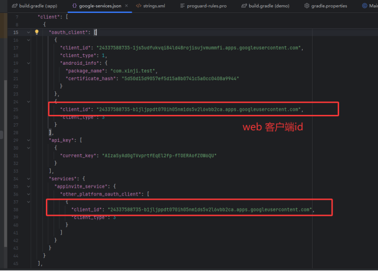

# 海外 SDK 接入文档

## 概述

本文档面向安卓开发者，用于指导开发者快速接入海外SDK。本SDK用于Android APP嵌入用户中心、收费模块、广告弹窗模块。

**支持功能：**
- 用户中心：浩凡账号、Facebook、Amazon、Google登录
- 支付模块：支付宝、微信、Google、PayPal、MyCard

**重要提醒：**
- **所有的SDK操作都必须在应用成功授权之后才能继续执行**
- **最新更新内容均已（此颜色标注）**

---

## 2. 接入流程

### 2.1 申请应用配置

#### 2.1.1 查看出包物料

| 名称 | 值 |
|------|----|
| **包名** | com.xx.xx |
| **游戏名称** | 安卓测试 |
| **游戏PID** | 310000 |
| **内购ID** | hfceshi1 |
| **Facebook授权Key** | facebook登录需要配置的参数（不用facebook可不提供） |
| **Adjust授权key** | Adjust追踪配置的参数 |
| **Tiktok自归因参数** | xxxxxxx(不用tiktok可不提供) |
| **Google-services.json** | FirebaseAndroid配置文件 |
| **api_key.txt** | Amazon授权key（无amazon登录可不提供） |

#### 2.1.2 环境要求
**注：最低版本不能低于35，google要求**

```gradle
compileSdkVersion 35
buildToolsVersion "35.0.0"
minSdkVersion ≥23
Gradle版本>8.0
```

### 2.2 根据包名创建项目
生成debug的sha1和release的sha1，提供给我方的运营人员，且提供facebook的测试账号，google的测试账号以及Adjust的测试账号。

### 2.3 导入资源包

#### 2.3.1 添加仓库

```gradle
repositories {
    google()
    jcenter()
    mavenCentral()
    maven { url "https://jitpack.io" }
    maven { url "https://dl-maven-android.mintegral.com/repository/se_sdk_for_android/" }
    
    //topon广告仓库（不接广告不用引用）
    flatDir { dirs 'libs' }
    maven { url "https://jfrog.anythinktech.com/artifactory/overseas_sdk" }
    
    //tiktok仓库
    maven { url 'https://jitpack.io' }
    
    //SDK适配器仓库
    maven {
        url "https://maven.pkg.github.com/fjlingliu/xinjiAndroidSdk"
        credentials {
            username = "xxxx"
            password = "xxxxxxxxx"
        }
    }
}
```

#### 2.3.2 配置build.gradle文件

**添加引用：**

```gradle
//核心库
implementation 'com.xxx.xxx:core:xxxx'
implementation 'com.xxx.xxxx:pay-google:xxxx'

//基础库
implementation 'androidx.appcompat:appcompat:1.4.1'
implementation 'com.google.android.material:material:1.12.0'
implementation(platform("com.google.firebase:firebase-bom:33.15.0"))
implementation 'com.google.firebase:firebase-analytics'
implementation 'androidx.constraintlayout:constraintlayout:2.1.4'
implementation 'com.google.code.gson:gson:2.8.9'
```

### 2.4 配置应用参数

#### 2.4.1 string.xml配置

```xml
<!-- google参数（必填） -->
<string name="google_web_client_id"></string>

<!-- fb登录参数 -->
<string name="facebook_app_id"></string>
<string name="fb_login_protocol_scheme"></string>
<string name="facebook_client_token"></string>

<!-- adjust事件 -->
<string name="adjust_app_key"></string>

<!-- 应用唯一标志 -->
<string name="application_id"></string>

<!-- tiktok事件自归因 -->
<string name="tt_app_id"></string>

<!-- 广告相关 -->
<string name="applovin_sdk_key"></string>
<string name="gg_admob_app_id"></string>
```

**注意：**
- fb配置若无接入可为空
    - `fb_login_protocol_scheme` = "fb"+facebook_app_id
    - `facebook_client_token`对应物料中的"客户端口令"
- `application_id`为应用唯一标志
- `Goolge_web_client_id`可从Google-service.json文件中获取



#### 2.4.2 amazon登录授权key
将api_key.txt文件移入assets文件夹下


#### 2.4.3 添加google play服务

```gradle
buildscript {
    repositories {
        google()
        mavenCentral()
        maven { url 'https://maven.google.com' }
    }
    dependencies {
        classpath 'com.android.tools.build:gradle:8.4.0'
        classpath 'com.google.gms:google-services:4.3.15'
    }
}

allprojects {
    repositories {
        google()
        mavenCentral()
        jcenter()
    }
}
```

### 2.5 google-services.json配置
将配置文件移动到应用的模块（应用级）目录中。


### 2.6 应用级build.gradle配置

```gradle
apply plugin: 'com.android.application'
apply plugin: 'com.google.gms.google-services'  // Google Services plugin

android {
    // ...
}
```

---

## 3. 接口说明

### 3.0 初始化
**必须在Application的onCreate中初始化**

```java
public class MyApplication extends Application {
    @Override
    public void onCreate() {
        super.onCreate();
        IGameManage.Builder.build().onAppCreate(this);
    }
}
```

### 3.1 授权接口
**必须在APP启动时调用（登录前）**

```java
IGameManage.Builder.build().init(Activity activity, 
    AuthorizationRequest request, 
    XJInitCallBack callBack);
```

**参数说明：**

| 参数 | 可否为空 | 描述 |
|------|----------|------|
| Activity | 否 | 上下文 |
| InitRequest | 否 | 授权信息 |
| InitCallBack | 否 | 授权回调对象 |

**InitRequest实体类：**

| 字段 | 可否为空 | 说明 |
|------|----------|------|
| fullScreen | 否 | 是否全屏 |
| pid | 否 | 游戏PID |
| gameName | 否 | 游戏名称 |

**InitCallBack回调：**

| 方法 | 说明 |
|------|------|
| onLogout() | 退出登录成功 |
| onBindThirdPart() | 绑定三方登录回调 |
| onCancellationAccount() | 注销账号成功 |
| onInitResult() | 授权结果回调 |
| onTrackEvents() | SDK内部事件回调 |

**示例：**

```java
InitRequest request = new InitRequest();
request.setFullScreen(fullScreen);
request.setPid(pid);
request.setGameName(gameName);

IGameManage.Builder.build().init(activity, request, new InitCallBack() {
    @Override
    public void onInitResult(int code, String s) {
        if (code == ResultCode.SUC.getResultCode()) {
            // 授权成功
        }
    }
    // 其他回调方法...
});
```

### 3.1.1 生命周期管理
**在游戏主Activity中添加：**

```java
@Override
protected void onResume() {
    super.onResume();
    IGameManage.Builder.build().onActivityResume(this);
}

@Override
protected void onPause() {
    super.onPause();
    IGameManage.Builder.build().onActivityPause();
}

@Override
protected void onDestroy() {
    super.onDestroy();
    IGameManage.Builder.build().onActivityDestroy();
}
```

### 3.2 登录接口

```java
IGameManage.Builder.build().login(Activity activity, LoginModeCallBack callBack);
```

**回调说明：**

| 方法 | 说明 |
|------|------|
| onLoginModeSuccess() | 登录成功 |
| onLoginModeFail() | 登录失败 |
| onLoginModeCancel() | 用户取消 |

### 3.3 支付接口

```java
IGameManage.Builder.build().pay(Activity activity, 
    PayRequest request, 
    PayCallBack callBack);
```

**PayRequest参数：**

| 字段 | 类型 | 说明 |
|------|------|------|
| amount | int | 订单金额(美分) |
| companyOrderNo | String | 唯一订单号 |
| productId | String | 内购ID |
| ... | ... | ... |

**支付回调：**

| 方法 | 说明 |
|------|------|
| onSuccess() | 支付成功 |
| onFailed() | 支付失败 |
| onCancel() | 取消支付 |

### 3.4 退出接口

```java
IGameManage.Builder.build().exit(Activity act, ExitCallBack callBack);
```

### 3.5 角色信息提交

```java
IGameManage.Builder.build().submitGameEventInfo(Activity, 
    GameEventType, 
    GameEventInfoRequest, 
    SubmitUserRoleCallBack);
```

### 3.6 其他接口
- 退出登录：`IGameManage.Builder.build().logout()`
- 绑定第三方：`IGameManage.Builder.build().bindThirdPart(activity)`

---

## 4. 注意事项
1. 所有SDK接口都需要在授权成功后调用
2. 接口请在主线程调用
3. Apk请勿加固